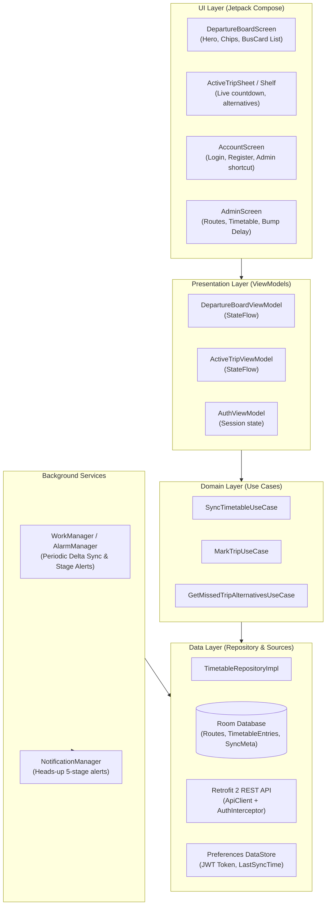

# YBiL (Your Bus in Line) - Comprehensive System Documentation & Android Engineering Blueprint

> **Purpose of this Document**: This document provides an exhaustive, production-grade technical specification of the entire **YBiL** transit platform. It details the **Spring Boot / Kotlin backend**, the **React / TypeScript offline-first web client**, the **data models & REST APIs**, the **business logic algorithms**, and the **architectural blueprint for building the native Android application in Jetpack Compose**.
> Any AI coding assistant or software engineer can ingest this document to understand the system completely and generate precise, compatible native Android code.

---

## 1. Executive Product Overview

**YBiL (Your Bus in Line)** is a smart transit operations and passenger assistance platform specifically engineered for the **Colombo Central Bus Terminal** (and inter-provincial bus transit in Sri Lanka).

### Primary Problem Solved

Passengers at bustling transit terminals face uncertain departure schedules, unannounced platform bay parking, missing real-time status updates, and frantic last-minute dashes to the terminal. YBiL delivers:

1. **Live Terminal Departure Board**: Real-time departures with countdown timers (`in 12m`, `Leaving now`), platform stands, and operator categorization.
2. **Offline-First Resilience**: Full timetable and route catalog cached locally on device; works seamlessly without active cellular coverage.
3. **Active Trip Tracking**: Passengers can "Mark" their intended departure. The system actively monitors time, alerts them when the bus arrives at the parking bay, warns them at T-15m and T-5m, and triggers an immediate alternative bus fallback if the trip is missed.
4. **Dispatcher Admin Portal**: Fleet controllers can register transit route corridors, add or bumper departures (+5m, +10m delays), bulk-import timetables from spreadsheets (CSV/XLSX/JSON), and force cache synchronization.

---

## 2. Global Domain Terminology & Enums

| Entity / Concept   | Valid Values                                 | Description                                                                                                                                                                    |
| :----------------- | :------------------------------------------- | :----------------------------------------------------------------------------------------------------------------------------------------------------------------------------- |
| **`OperatorType`** | `SLTB`, `PRIVATE`                            | `SLTB`: Sri Lanka Transport Board (state-run buses). `PRIVATE`: Private omnibus operators.                                                                                     |
| **`BusCategory`**  | `NORMAL`, `SEMI`, `LUXURY_AC`, `EXPRESSWAY`  | Service quality tiers. `NORMAL` (Standard fare), `SEMI` (Semi-luxury), `LUXURY_AC` (Air-conditioned intercity), `EXPRESSWAY` (Southern/Central expressway high-speed coaches). |
| **`TripStatus`**   | `ACTIVE`, `MISSED`, `COMPLETED`, `CANCELLED` | Lifecycle of a marked passenger trip. Only 1 trip can be `ACTIVE` per user at a time.                                                                                          |
| **`Role`**         | `ROLE_PASSENGER`, `ROLE_ADMIN`               | Spring Security authorities. Admins have access to `/api/admin/**`.                                                                                                            |
| **Time Format**    | `HH:mm` (24-hour)                            | E.g. `"08:30"`, `"14:15"`. Local Sri Lanka Standard Time (UTC+05:30).                                                                                                          |
| **Timestamps**     | Epoch milliseconds (`Long`)                  | E.g. `1725800000000`. Used across delta synchronization checkpoints (`updatedAt`, `syncedAt`).                                                                                 |

---

## 3. Backend Architecture & REST API Specification

- **Framework**: Spring Boot 3.x (Kotlin 2.x, JDK 21 / 17).
- **Security**: Stateless JWT Authentication (`Authorization: Bearer <token>`), Spring Security with method security (`@PreAuthorize`).
- **Persistence**: Spring Data JPA / Hibernate with PostgreSQL (and H2 in-memory profile).
- **Default Port**: `8080`.
- **Android Emulator Base URL**: `http://10.0.2.2:8080` (or `http://<your-local-ip>:8080` for physical devices).

---

### A. Authentication Endpoints (`/api/auth`)

#### 1. Register User

- **Method / URL**: `POST /api/auth/register`
- **Access**: Public
- **Request Body**:
  ```json
  {
    "username": "passenger1",
    "password": "securePassword123"
  }
  ```
- **Response** (`200 OK` or `201 Created`):
  ```json
  {
    "accessToken": "eyJhbGciOiJIUzI1NiIsInR5cCI6IkpXVCJ9...",
    "tokenType": "Bearer",
    "user": {
      "id": "c1f7b2c0-84a1-4322-92e1-456789abcdef",
      "username": "passenger1",
      "role": "ROLE_PASSENGER"
    }
  }
  ```

#### 2. Login User

- **Method / URL**: `POST /api/auth/login`
- **Access**: Public
- **Request Body**:
  ```json
  {
    "username": "passenger1",
    "password": "securePassword123"
  }
  ```
- **Response** (`200 OK`): Same payload as Register.

#### 3. Current User Profile

- **Method / URL**: `GET /api/auth/me`
- **Access**: Authenticated (`Bearer <token>`)
- **Response** (`200 OK`):
  ```json
  {
    "id": "c1f7b2c0-84a1-4322-92e1-456789abcdef",
    "username": "passenger1",
    "role": "ROLE_PASSENGER"
  }
  ```

---

### B. Public Timetable & Delta Sync Endpoints (`/api/public`)

#### 1. Delta Synchronization Protocol

- **Method / URL**: `GET /api/public/timetable/sync?since={epochMilli}`
- **Access**: Public
- **Query Parameter**:
  - `since` (optional `Long`): If omitted or `0`, server returns **full snapshot** of all active entries. If specified, server returns only entries where `updatedAt > since`.
- **Response** (`200 OK`):
  ```json
  {
    "syncedAt": 1725801234567,
    "totalCount": 42,
    "entries": [
      {
        "id": "7d9b2311-6455-4679-b769-123456789abc",
        "route": {
          "id": "00000000-0000-0000-0000-000000000001",
          "routeNumber": "138",
          "origin": "Colombo Central",
          "destination": "Maharagama"
        },
        "operatorType": "SLTB",
        "busCategory": "NORMAL",
        "busNumber": "NB-4521",
        "scheduledParkingTime": "08:15",
        "scheduledLeavingTime": "08:30",
        "updatedAt": 1725800000000
      }
    ],
    "deletedEntryIds": []
  }
  ```

#### 2. Get Public Routes Catalog

- **Method / URL**: `GET /api/public/routes`
- **Access**: Public
- **Response** (`200 OK`):
  ```json
  [
    {
      "id": "00000000-0000-0000-0000-000000000001",
      "routeNumber": "138",
      "origin": "Colombo Central",
      "destination": "Maharagama"
    },
    {
      "id": "00000000-0000-0000-0000-000000000002",
      "routeNumber": "100",
      "origin": "Colombo Central",
      "destination": "Panadura"
    }
  ]
  ```

---

### C. Passenger Marked Trips Endpoints (`/api/trips`)

_All require `Authorization: Bearer <token>`._

#### 1. Mark an Active Trip

- **Method / URL**: `POST /api/trips/mark`
- **Request Body**:
  ```json
  {
    "timetableEntryId": "7d9b2311-6455-4679-b769-123456789abc"
  }
  ```
- **Business Logic**:
  - Automatically deactivates/cancels any previous `ACTIVE` trip for this user (only 1 active trip allowed).
  - Reactivates if an existing trip for this entry was previously cancelled.
- **Response** (`201 Created` or `200 OK`):
  ```json
  {
    "id": "e3a89012-9876-4321-bbbb-555555555555",
    "timetableEntry": {
      "id": "7d9b2311-6455-4679-b769-123456789abc",
      "route": {
        "id": "00000000-0000-0000-0000-000000000001",
        "routeNumber": "138",
        "origin": "Colombo Central",
        "destination": "Maharagama"
      },
      "operatorType": "SLTB",
      "busCategory": "NORMAL",
      "busNumber": "NB-4521",
      "scheduledParkingTime": "08:15",
      "scheduledLeavingTime": "08:30",
      "updatedAt": 1725800000000
    },
    "status": "ACTIVE",
    "createdAt": "2026-09-08T08:00:00Z"
  }
  ```

#### 2. Get User Active Trips

- **Method / URL**: `GET /api/trips/active`
- **Response** (`200 OK`): List of active marked trips (`List<MarkedTripResponse>`).

#### 3. Cancel / Unmark Trip

- **Method / URL**: `DELETE /api/trips/{tripId}`
- **Response** (`204 No Content`): Trip status set to `CANCELLED`.

#### 4. Handle Missed Bus Fallback

- **Method / URL**: `POST /api/trips/{tripId}/missed`
- **Business Logic**:
  - Marks current trip as `MISSED`.
  - Queries upcoming departures on the same route with `scheduledLeavingTime > current_trip.scheduledLeavingTime`.
- **Response** (`200 OK`):
  ```json
  {
    "missedTripId": "e3a89012-9876-4321-bbbb-555555555555",
    "message": "Trip marked as missed. Here are upcoming departures on this corridor.",
    "alternatives": [
      {
        "id": "8f12a344-9988-7766-5544-33221100aabb",
        "route": {
          "id": "...",
          "routeNumber": "138",
          "origin": "Colombo Central",
          "destination": "Maharagama"
        },
        "operatorType": "PRIVATE",
        "busCategory": "LUXURY_AC",
        "busNumber": "ND-9011",
        "scheduledParkingTime": "08:45",
        "scheduledLeavingTime": "09:00",
        "updatedAt": 1725800000000
      }
    ]
  }
  ```

---

### D. Admin Dispatcher Management Endpoints (`/api/admin`)

_Requires `Authorization: Bearer <token>` with `ROLE_ADMIN`._

| Method   | Endpoint                    | Request Body                                                                                                                                                      | Response Status  | Description                          |
| :------- | :-------------------------- | :---------------------------------------------------------------------------------------------------------------------------------------------------------------- | :--------------- | :----------------------------------- |
| `POST`   | `/api/admin/routes`         | `{ "routeNumber": "138", "origin": "Colombo Central", "destination": "Maharagama" }`                                                                              | `201 Created`    | Register new transit corridor        |
| `GET`    | `/api/admin/routes`         | _None_                                                                                                                                                            | `200 OK`         | List all routes                      |
| `PUT`    | `/api/admin/routes/{id}`    | `{ "routeNumber": "138", "origin": "Colombo Central", "destination": "Homagama" }`                                                                                | `200 OK`         | Update route corridor details        |
| `DELETE` | `/api/admin/routes/{id}`    | _None_                                                                                                                                                            | `204 No Content` | Delete a transit corridor            |
| `POST`   | `/api/admin/timetable`      | `{ "routeId": "...", "operatorType": "SLTB", "busCategory": "NORMAL", "busNumber": "NB-1234", "scheduledParkingTime": "08:00", "scheduledLeavingTime": "08:30" }` | `201 Created`    | Create scheduled departure           |
| `GET`    | `/api/admin/timetable`      | _None_                                                                                                                                                            | `200 OK`         | List all timetable entries           |
| `PUT`    | `/api/admin/timetable/{id}` | `{ "routeId": "...", "operatorType": "SLTB", "busCategory": "NORMAL", "busNumber": "NB-1234", "scheduledParkingTime": "08:15", "scheduledLeavingTime": "08:45" }` | `200 OK`         | Update departure (e.g. bumper delay) |
| `DELETE` | `/api/admin/timetable/{id}` | _None_                                                                                                                                                            | `204 No Content` | Delete scheduled departure           |

---

## 4. Core Business Logic & Algorithms

### A. Real-Time Departure Countdown Engine

Given current local device time (`now`) and a bus's `scheduledLeavingTime` (`"HH:mm"`):

```kotlin
data class DepartureStatus(
    val label: String,          // e.g. "in 14m", "Leaving now", "Departed 5m ago"
    val diffMinutes: Long,      // Difference in minutes
    val isUrgent: Boolean,      // <= 15 minutes away
    val hasDeparted: Boolean,   // diffMinutes < 0
    val shouldHide: Boolean     // Departed more than 15m ago -> prune from active feed
)

fun calculateDepartureStatus(leavingTimeStr: String, now: LocalTime): DepartureStatus {
    val (hours, minutes) = leavingTimeStr.split(":").map { it.toInt() }
    val leavingTime = LocalTime.of(hours, minutes)
    val diffMinutes = ChronoUnit.MINUTES.between(now, leavingTime)

    return when {
        diffMinutes < -15 -> DepartureStatus("Departed", diffMinutes, false, true, true)
        diffMinutes < 0 -> DepartureStatus("Departed ${Math.abs(diffMinutes)}m ago", diffMinutes, false, true, false)
        diffMinutes == 0L -> DepartureStatus("Leaving now", 0, true, false, false)
        diffMinutes <= 15L -> DepartureStatus("in ${diffMinutes}m", diffMinutes, true, false, false)
        diffMinutes < 60L -> DepartureStatus("in ${diffMinutes}m", diffMinutes, false, false, false)
        else -> {
            val hoursLeft = diffMinutes / 60
            val remMins = diffMinutes % 60
            val label = if (remMins > 0) "in ${hoursLeft}h ${remMins}m" else "in ${hoursLeft}h"
            DepartureStatus(label, diffMinutes, false, false, false)
        }
    }
}
```

### B. 5-Stage Departure Notification Alert Pipeline

When a passenger has an `ACTIVE` trip marked, the app monitors `scheduledParkingTime` and `scheduledLeavingTime` on a 15–30 second periodic cycle:

1. **Stage 1: Bus Parked (Bay Arrival)**
   - _Condition_: `now >= scheduledParkingTime && now < scheduledLeavingTime`
   - _Title_: `Bus Arrived at Bay · Colombo Central`
   - _Body_: `Bus [BusNumber] to [Destination] is now parked and preparing for boarding.`
   - _Action_: Vibrate `[200, 100, 200]`.

2. **Stage 2: T-15 Minutes Warning**
   - _Condition_: `diffMinutes <= 15 && diffMinutes > 5`
   - _Title_: `Trip Reminder · 15m Left`
   - _Body_: `Bus [BusNumber] ([BusCategory]) departs in 15 minutes. Head towards the platform.`

3. **Stage 3: T-5 Minutes Boarding Alert**
   - _Condition_: `diffMinutes <= 5 && diffMinutes > 0`
   - _Title_: `Final Call · Boarding Now`
   - _Body_: `Bus [BusNumber] leaves in 5 minutes! Board immediately.`

4. **Stage 4: Leaving Now**
   - _Condition_: `diffMinutes == 0`
   - _Title_: `Departure Notice`
   - _Body_: `Bus [BusNumber] is now departing Colombo Central.`

5. **Stage 5: Missed Bus Alert**
   - _Condition_: `diffMinutes < 0 && !hasDismissed`
   - _Title_: `Did you miss your bus?`
   - _Body_: `Bus [BusNumber] has left. Tap to view upcoming departures on route [RouteNumber].`
   - _Action_: Tapping opens the "Missed Bus" alternatives bottom sheet.

_Deduplication Rule_: Every alert stage must only trigger once per marked trip ID (track sent alerts in a local Set or database column).

---

## 5. UI/UX Design System & Color Tokens

YBiL uses a modern transit theme optimized for both day-time glare and night terminal visibility.

| Token Name             | Light Theme Value              | Dark Theme Value               | Usage                                |
| :--------------------- | :----------------------------- | :----------------------------- | :----------------------------------- |
| **Background Surface** | `#f4f7f7` (Slate 50)           | `#0f172a` (Slate 950)          | Main scaffold background             |
| **Card Surface**       | `#ffffff` (Pure White)         | `#162026` / `#1e293b`          | Elevated cards, list items           |
| **Primary Ink**        | `#17232c` (Slate 900)          | `#f8fafc` (Slate 50)           | Main headlines, route numbers        |
| **Muted Ink**          | `#75838c` (Slate 500)          | `#94a3b8` (Slate 400)          | Timestamps, subtitles                |
| **Border / Divider**   | `#dce5e8`                      | `#334155` / `#1e293b`          | Outlines, card dividers              |
| **SLTB Red**           | `#dc2626` / `#e94b50`          | `#ef4444` / `#f87171`          | SLTB badge, operator pill            |
| **Private Gold/Blue**  | `#2563eb` / `#d97706`          | `#38bdf8` / `#fbbf24`          | Private bus operator badge           |
| **Online Green**       | `#25856f` (Pill bg: `#e9f8f3`) | `#34d399` (Pill bg: `#064e3b`) | Live sync status indicator           |
| **Urgent Amber**       | `#f59e0b`                      | `#fbbf24`                      | Urgent countdown badge (T-15m pulse) |

- **Typography**: Space Grotesk / Monospace font for numerals, route numbers, and clock displays; Clean Sans-Serif (DM Sans or Roboto) for labels.
- **Touch Target**: Minimum $48 \times 48\text{ dp}$ for all interactable chips, buttons, and switches.

---

## 6. Native Android App (`ybilmobile`) Architecture Blueprint

The Android project is located at `e:\My Projects\YBiL\Root\ybilmobile` configured with:

- **Language**: Kotlin 2.x
- **UI Toolkit**: Jetpack Compose + Material 3
- **Min SDK**: 26 (Android 8.0 Oreo)
- **Target SDK**: 36 (Android 15+)

### A. Recommended Layered Architecture (Clean MVVM)



---

### B. Recommended Android Dependencies (`libs.versions.toml` / `build.gradle.kts`)

```toml
[versions]
retrofit = "2.11.0"
okhttp = "4.12.0"
room = "2.6.1"
datastore = "1.1.2"
workmanager = "2.10.0"
navigationCompose = "2.8.8"
lifecycle = "2.8.7"
koin = "4.0.0" # or hilt = "2.51.1"

[libraries]
# Networking
retrofit-core = { module = "com.squareup.retrofit2:retrofit", version.ref = "retrofit" }
retrofit-converter-gson = { module = "com.squareup.retrofit2:converter-gson", version.ref = "retrofit" }
okhttp-logging = { module = "com.squareup.okhttp3:logging-interceptor", version.ref = "okhttp" }

# Local Database (Room)
room-runtime = { module = "androidx.room:room-runtime", version.ref = "room" }
room-ktx = { module = "androidx.room:room-ktx", version.ref = "room" }
room-compiler = { module = "androidx.room:room-compiler", version.ref = "room" }

# DataStore Preferences
datastore-preferences = { module = "androidx.datastore:datastore-preferences", version.ref = "datastore" }

# Navigation & Lifecycle
navigation-compose = { module = "androidx.navigation:navigation-compose", version.ref = "navigationCompose" }
lifecycle-viewmodel-compose = { module = "androidx.lifecycle:lifecycle-viewmodel-compose", version.ref = "lifecycle" }

# WorkManager
work-runtime-ktx = { module = "androidx.work:work-runtime-ktx", version.ref = "workmanager" }
```

---

### C. Android Room Database Entities (Counterpart to Web IndexedDB)

#### 1. `RouteEntity.kt`

```kotlin
@Entity(tableName = "routes")
data class RouteEntity(
    @PrimaryKey val id: String, // UUID
    val routeNumber: String,
    val origin: String,
    val destination: String
)
```

#### 2. `TimetableEntryEntity.kt`

```kotlin
@Entity(
    tableName = "timetable_entries",
    indices = [
        Index("routeId"),
        Index("scheduledLeavingTime"),
        Index("updatedAt")
    ]
)
data class TimetableEntryEntity(
    @PrimaryKey val id: String, // UUID
    val routeId: String,
    val routeNumber: String,
    val origin: String,
    val destination: String,
    val operatorType: String, // "SLTB" | "PRIVATE"
    val busCategory: String,  // "NORMAL" | "SEMI" | "LUXURY_AC" | "EXPRESSWAY"
    val busNumber: String?,
    val scheduledParkingTime: String, // "HH:mm"
    val scheduledLeavingTime: String, // "HH:mm"
    val updatedAt: Long
)
```

#### 3. `SyncMetadataEntity.kt`

```kotlin
@Entity(tableName = "sync_metadata")
data class SyncMetadataEntity(
    @PrimaryKey val key: String,
    val value: String
)
```

---

### D. Network Interceptor for JWT (`AuthInterceptor.kt`)

```kotlin
class AuthInterceptor(private val tokenProvider: suspend () -> String?) : Interceptor {
    override fun intercept(chain: Interceptor.Chain): Response {
        val original = chain.request()
        val token = runBlocking { tokenProvider() }
        val request = if (!token.isNullOrBlank()) {
            original.newBuilder()
                .header("Authorization", "Bearer $token")
                .header("Accept", "application/json")
                .build()
        } else {
            original.newBuilder()
                .header("Accept", "application/json")
                .build()
        }
        return chain.proceed(request)
    }
}
```

---

### E. Web App vs. Native Android Component Mapping

| Web App (`ybil-web`)              | Android App (`ybilmobile`)                       | Responsibility                                        |
| :-------------------------------- | :----------------------------------------------- | :---------------------------------------------------- |
| `IndexedDB` (Dexie.js `db.ts`)    | **Room Database** (`YBiLDatabase`)               | Local persistent cache for offline timetables         |
| `localStorage` (`token`, `theme`) | **DataStore Preferences**                        | Storing JWT auth tokens & theme preference            |
| `syncService.ts` (`runDeltaSync`) | **`TimetableRepository.sync()`**                 | Delta synchronization with backend `?since=`          |
| `useLiveClock.ts` (15s ticker)    | **Compose `produceState` / Coroutine Ticker**    | Re-evaluates `calculateDepartureStatus` every 15s     |
| `useDepartureAlerts.ts`           | **`DepartureNotificationWorker` (WorkManager)**  | 5-stage push notification alerts                      |
| `BusCard.tsx`                     | **`BusCard` Composable**                         | Bus plate card with countdown badge and Stand time    |
| `ActiveTripShelf.tsx`             | **`ActiveTripBottomBar` or Compose BottomSheet** | Sticky banner with marked bus & alternative switchers |
| `AdminDashboardPage.tsx`          | **`AdminScreen` Composable**                     | Timetable and Routes CRUD management                  |
| `TailwindCSS` (`dark:` mode)      | **Material3 `ColorScheme` (`DarkColorScheme`)**  | Jetpack Compose dynamic dark & light themes           |

---

## 7. Step-by-Step Android Learning & Implementation Roadmap

When you prompt an AI to write code for your Android project, follow this recommended 5-phase sequence:

### Phase 1: Core Networking & Local Database

1. **API Models & Retrofit Interface**: Write the Kotlin data classes for all requests/responses and the `YBiLApiService`.
2. **Room Database**: Create `RouteEntity`, `TimetableEntryEntity`, DAOs with Flow queries, and the Room database builder.
3. **Repository Layer**: Build `TimetableRepository` with offline-first delta sync logic (`syncWithServer()`).

### Phase 2: Jetpack Compose Theme & Design System

1. Implement `Color.kt`, `Theme.kt`, and `Type.kt` using the exact YBiL design tokens.
2. Build reusable composables:
   - `OperatorBadge` (`SLTB` red, `PRIVATE` blue/gold)
   - `CategoryChip` (`Normal`, `Semi-Exp`, `Luxury AC`, `Expressway`)
   - `CountdownBadge` (Green normal, Amber pulse for $\le 15\text{m}$, Dimmed departed)

### Phase 3: Live Departure Board Screen

1. Create `DepartureBoardViewModel` exposing `StateFlow<BoardUiState>`.
2. Wire search filter (route number, destination, plate), operator filter tabs, and category filter chips.
3. Build `BusCard` and `LazyColumn` departure board with smooth pull-to-refresh (`pullRefresh` or `SwipeRefresh`).

### Phase 4: Authentication & Active Trip Tracking

1. Build `AuthViewModel` with DataStore JWT persistence.
2. Create `AuthBottomSheet` for login and registration.
3. Wire the "Mark Trip" action: highlight marked card, show sticky `ActiveTripShelf` at the bottom of the screen.

### Phase 5: Notifications & Admin Management

1. Set up Android `NotificationChannel` (`ybil_trip_alerts`).
2. Implement `AlarmManager` or `WorkManager` for the 5-stage departure countdown alerts.
3. (Optional) Build the Admin screens (`RoutesScreen` and `AddScheduleDialog`) for users holding `ROLE_ADMIN`.

---

## 8. Summary Prompt Template to Provide to Any AI Assistant

Copy and paste the following snippet into an AI coding assistant whenever you ask for Android code:

```text
I am building the native Android application for YBiL (Your Bus in Line) using Android Studio, Kotlin 2.x, and Jetpack Compose Material 3.
The system is an offline-first bus departure platform for Colombo Central Bus Terminal connected to a Spring Boot 3.x backend.

Please reference the project documentation in PROJECT_DOCUMENTATION.md:
- Backend base URL: http://10.0.2.2:8080 (Emulator)
- Auth: Bearer JWT in Authorization header
- Offline Storage: Room database caching routes and timetable entries
- Delta Sync: GET /api/public/timetable/sync?since={lastSyncTime}
- Key Enums: OperatorType (SLTB, PRIVATE), BusCategory (NORMAL, SEMI, LUXURY_AC, EXPRESSWAY), TripStatus (ACTIVE, MISSED, COMPLETED, CANCELLED)
- Time formatting: "HH:mm" (24-hour local time)

Please write idiomatic, clean, type-safe Kotlin code following MVVM and Clean Architecture.
```
